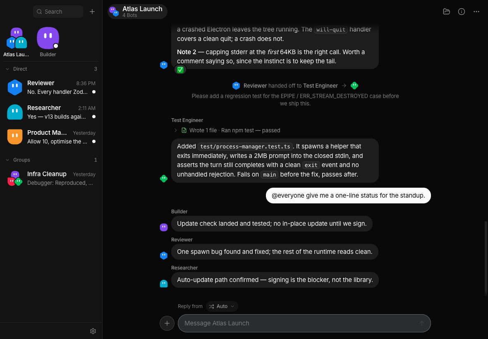
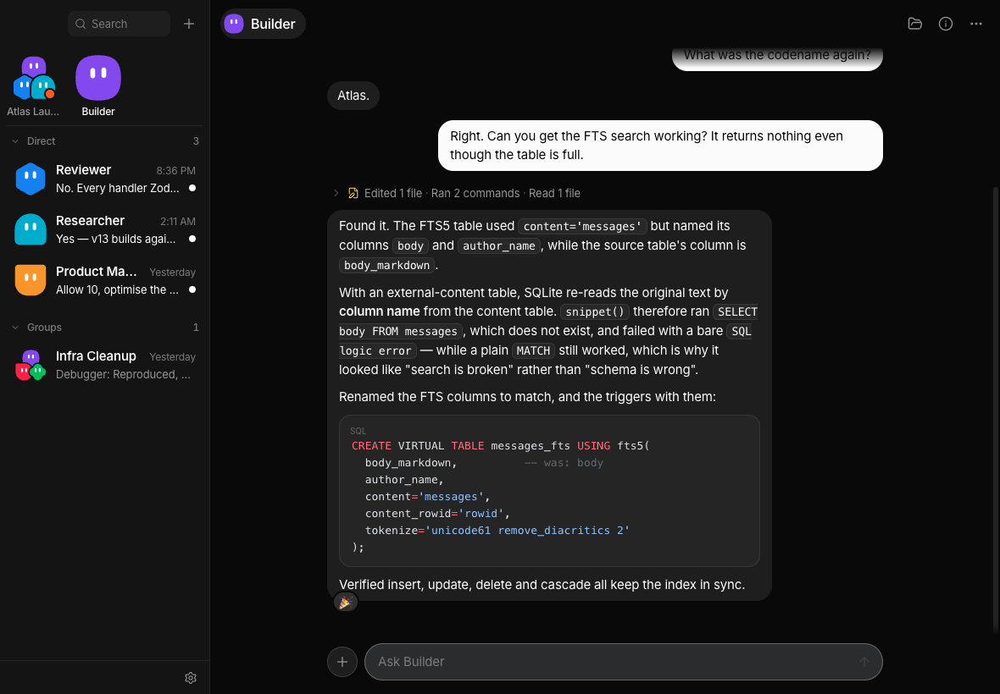
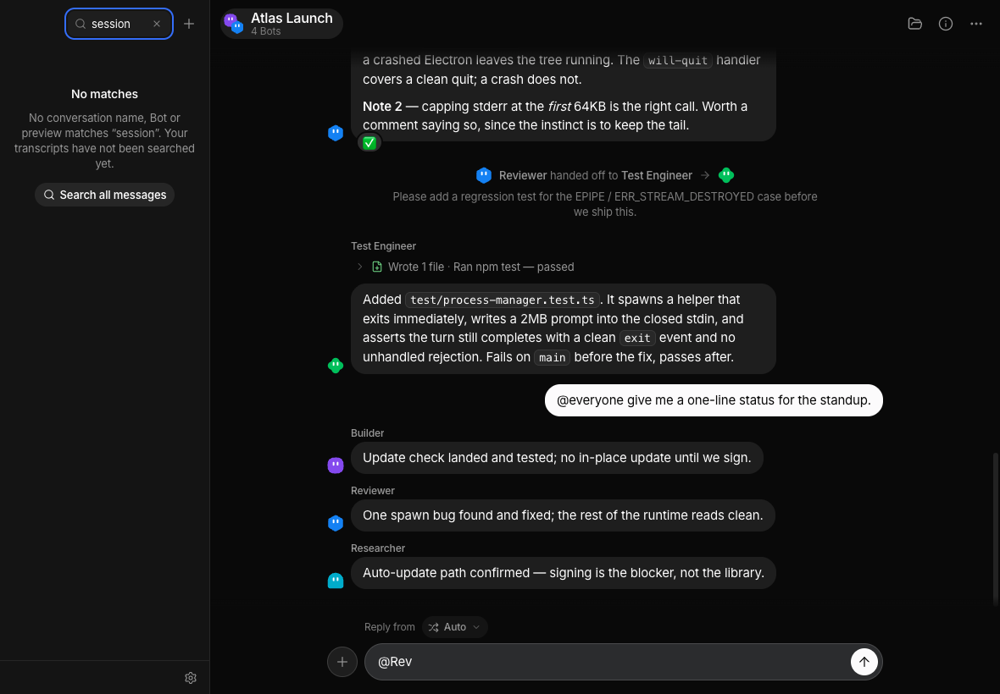
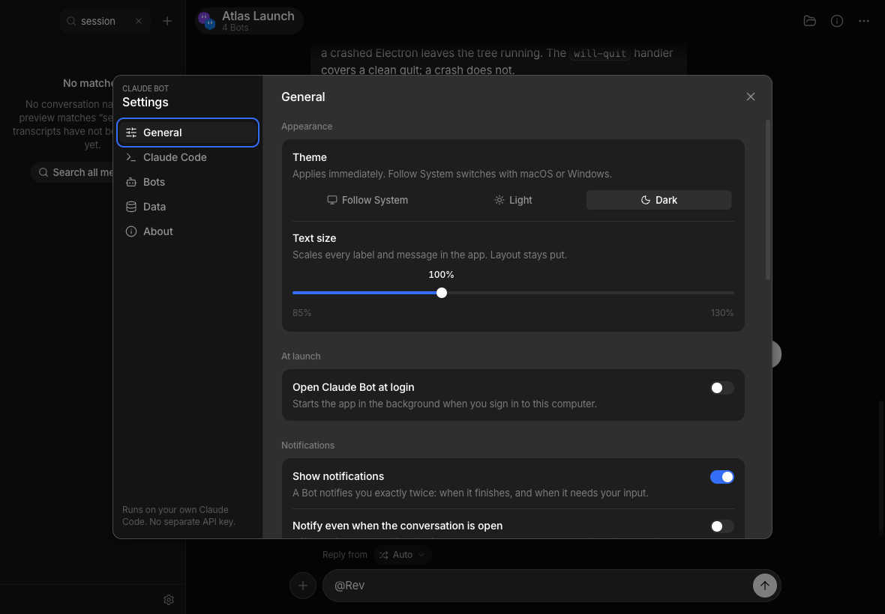
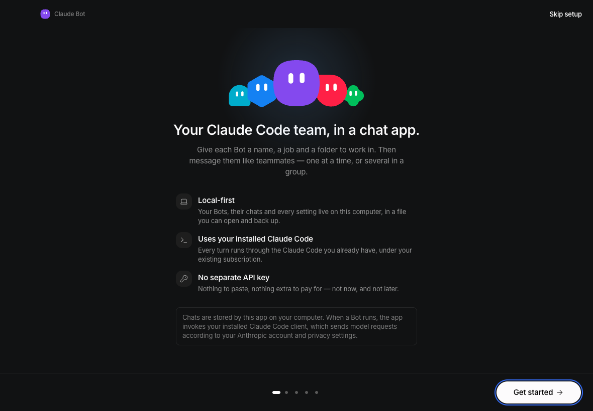

# Claude Bot

### Grok Bot, for Claude Code.

xAI's Grok Bot made the good argument that the interesting thing about durable agents isn't the
agent — it's the **messaging metaphor**: one roster, persistent named teammates with their own
jobs, group chats, `@mentions`, visible handoffs, work happening in parallel.

Claude Bot is that interaction model on top of the **Claude Code CLI you already have**. Same idea,
different engine — and where Grok Bot gives each Bot a cloud computer, every Bot here runs locally
through your own `claude` binary, under your existing subscription.

- **Local-first.** Bots, transcripts and settings live in SQLite on your machine. No backend.
- **Uses the Claude Code you already have.** Every turn shells out to your installed `claude`.
- **No API key.** Not now, not later. The app never reads, stores or asks for an Anthropic credential.



> A group conversation. `@everyone` fanned out to four Bots, Reviewer handed work to Test Engineer
> in the open, and each reply carries a one-line summary of the tools that Bot actually ran.

> Chats are stored by this app on your computer. When a Bot runs, the app invokes your installed
> Claude Code client, which sends model requests according to your Anthropic account and privacy
> settings. Inference is **not** local.

---

## What it looks like

| | |
|---|---|
|  <br> **1:1 chat.** iMessage-shaped bubbles, no per-message avatars or timestamps — time lives in a centred day separator. Tool activity collapses to one line above the answer. |  <br> **Creating a Bot.** Standing instructions, a working folder, model and permission mode — with a live preview and the shape/colour avatar picker. |
|  <br> **Settings → Claude Code.** Detected version, resolved binary path and auth health, checked without spending model quota. |  <br> **First run.** Detects Claude Code, verifies sign-in, then hands you six Bot presets to start from. |

---

## Requirements

- macOS 12+ (Windows and Linux build, but macOS is the tested target)
- Node.js 22+
- [Claude Code](https://docs.anthropic.com/en/docs/claude-code) installed and signed in
  (`claude --version` should work in your terminal)

The app resolves your login shell's `PATH` at startup, so it finds `claude` even when launched
from Finder — where a GUI app would otherwise only see `/usr/bin:/bin:/usr/sbin:/sbin`.

## Running it

```bash
npm install          # rebuilds better-sqlite3 for Electron automatically
npm run dev          # hot-reloading dev build
```

```bash
npm run build        # typecheck + bundle to out/
npm run pack:mac     # unsigned .app in dist/  (no Apple certificate needed)
npm run dist:dmg     # unsigned .dmg in dist/  (see below before you send it to anyone)
npm test             # 205 unit tests over the pure modules
npm run typecheck    # both tsconfig projects
```

### The build is unsigned, and a downloaded copy will not open

There is no Apple Developer ID behind this project, so `dist:dmg` produces
`claude-bot-<version>-<arch>-unsigned.dmg` — named that way on purpose. A build that has travelled
through a browser, AirDrop or a chat app arrives with `com.apple.quarantine` set, and macOS refuses
it with **"Claude Bot is damaged and can't be opened."** Nothing is damaged: that is what Gatekeeper
says about an unsigned bundle it cannot validate.

Right-click → Open does *not* help — that gesture overrides a policy decision, and this is a
signature-validation failure. The recipient's one-line fix is:

```bash
xattr -dr com.apple.quarantine "/Applications/Claude Bot.app"
```

Only run that on a build you compiled yourself or got from someone you trust; the same command
works just as well on a trojaned copy, which is precisely what code signing exists to tell you
apart. Building locally (`npm run pack:mac`) sets no quarantine flag and needs none of this.

---

## How it works

### One Claude session per (Bot × conversation)

The central design decision. A Bot in your 1:1 chat and the same Bot in the "Website Launch"
group get **separate** Claude Code sessions, keyed on `(bot_id, conversation_id)`. Context from
one conversation can never leak into another.

```
bot_conversation_sessions(bot_id, conversation_id) → claude_session_id, last_seen_message_id
```

### Process per turn

Each turn spawns one `claude` process rather than holding a PTY open:

```
claude -p                      # the prompt arrives on STDIN, never in argv
  --output-format stream-json
  --verbose
  --include-partial-messages   # token-level deltas for live streaming
  [--resume <session-id>]
  [--model …] [--permission-mode …]
  [--allowedTools …] [--disallowedTools …]
  [--mcp-config <path>]        # the handoff bridge, via a 0600 file
```

Simple lifecycle, trivial cancellation (the whole process **group** is signalled, so nothing is
orphaned), and Claude Code itself owns session durability.

### Group context bridging

Separate sessions cannot see each other, so before a Bot runs in a group the app injects the
messages added since that Bot last participated — capped by a character budget, oldest dropped
first, tool noise excluded:

```
You are participating in a shared group conversation named "Website Launch".

Team members:
- Builder (Engineer) [you]
- Researcher (Researcher)

Messages since you last participated:

[USER — Tyler]
@Researcher find the current docs for Electron auto-update.

[Researcher]
Electron's recommended update path is …

Now respond to the newest message addressed to you.
```

The watermark tracking "what has this Bot seen" is a **low-water mark** that cannot step over a
message another Bot is still streaming — otherwise two Bots answering in parallel silently lose
each other's replies.

### Deterministic mention routing

`@mentions` are stored **structurally** (`{botId, display, start, end}`), not re-parsed from text,
so renaming a Bot never breaks an old message. Routing spends no model quota: explicit mentions
win, then `@everyone`, then the composer's routing selector, then the group's default responder,
then the only idle Bot, then the first member.

### Bot-to-Bot handoffs

The app runs a loopback-only MCP server exposing `send_message_to_bot`, `send_message_to_group`
and `list_bots`. A handoff always posts a **visible** message in the transcript — no invisible
orchestration — and is bounded by a depth limit (3) and a per-human-message turn budget (8).

---

## Layout

```
src/
  main/            Electron main: the only process with SQLite, spawn and fs access
    db/            schema + migrations + repositories
    runtime/       ClaudeDetector · ClaudeStreamParser · ProcessManager · ClaudeCodeRuntime
    orchestration/ MentionRouter · GroupContextBridge · PromptBuilder · HandoffManager · JobScheduler
    mcp/           loopback control server + the stdio bridge Claude spawns
    ipc/           one Zod-validated handler per channel
  preload/         the only bridge; contextIsolation on, ipcRenderer never exposed
  renderer/        React 19 + Tailwind 4
  shared/          types and Zod schemas imported by all three
docs/
  ARCHITECTURE.md  module contract + measured Claude Code CLI behaviour
  DESIGN.md        design tokens, layout and component spec
  RENDERER.md      renderer code contract
```

## Security posture

`contextIsolation: true`, `nodeIntegration: false`, `sandbox: true`, and the renderer is served
from a private `app://` scheme so CSP `'self'` means the app bundle rather than every file on the
machine. No raw HTML from Bot output, every IPC input Zod-validated in main, every process spawned
with an argument array and `shell: false`, external links restricted to `http`/`https`/`mailto`.
The MCP control server binds `127.0.0.1` only, and each turn gets its own bearer token written to a
`0600` file rather than passed on a command line where `ps` would show it.

Bots are **not** a security boundary: they run as your OS user with whatever permissions your
Claude Code configuration grants. `bypassPermissions` is deliberately not exposed anywhere in the UI.

## Not in v1

No cloud computer, no hosted backend, no cross-device sync, no scheduled routines, no account
system, no billing. See [the PRD](claude-bot-prd.md) §5.

---

*Grok Bot is a product of xAI. This project is not affiliated with or endorsed by xAI — it is an
independent app that borrows the interaction model and runs on Anthropic's Claude Code.*
